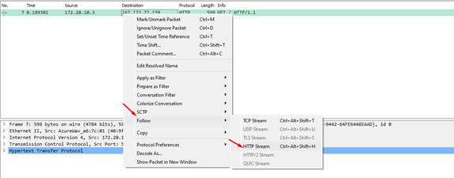
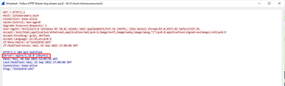
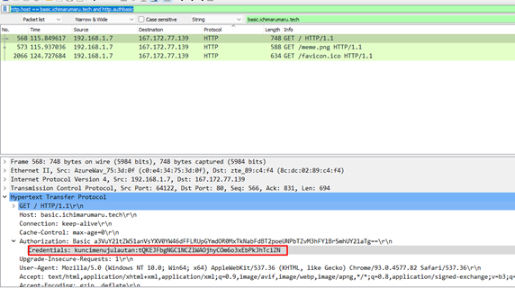
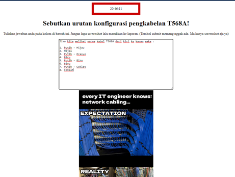
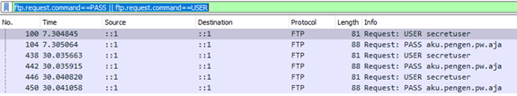
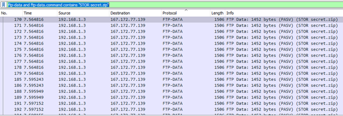
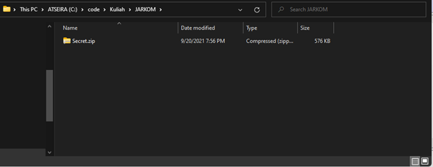

# Jarkom-Modul-1-E04-2021

Kelompok F07
1. I Kadek Agus Ariesta Putra 05111940000105
2. Axel Briano Suherik 05111940000137
3. Timotius Wirawan 05111940000161

## 1. Sebutkan web server yang digunakan pada "ichimarumaru.tech"!
- Gunakan command display filter `http.host == ichimarumaru.tech`
- Tersedia satu packet data yang ditampilkan lalu follow HTTP Stream

    
- Akan muncul deskripsi dari packet data tersebut dan dapat dilihat ada tertulis deksripsi server yaitu `nginx/1.18.0 (Ubuntu)`
    
    

## 2. Temukan paket dari web-web yang menggunakan basic authentication method!

## 3. Ikuti perintah di basic.ichimarumaru.tech! Username dan password bisa didapatkan dari file .pcapng!
- Gunakan command display filter `http.host == basic.ichimarumaru.tech and http.authbasic`. Diantara packet yang ditampilkan cari packet yang di bodynya berisikan Credential. Pada deskripsi Credential tersebut terdapat username dan password dengan pola username:password

    
- Dari pola tersebut dapat diketahui bahwa usernamenya yaitu kuncimenujulautan dan passwordnya yaitu tQKEJFbgNGC1NCZlWAOjhyCOm6o3xEbPkJhTciZN
- Setelahnya masuk ke laman basic.ichimarumaru.tech yang setelahnya akan ditampilkan laman login. Masukkan username dan password yang telah didapatkan sebelumnya dan akan muncul laman sebagai berikut yang telah dijawab pertanyaan di dalamnya.

    

## 4. Temukan paket mysql yang mengandung perintah query select!

## 5. Login ke portal.ichimarumaru.tech kemudian ikuti perintahnya! Username dan password bisa didapat dari query insert pada table users dari file .pcap!
- Gunakan command display filter `mysql and frame matches "(?i)insert`

## 6. Cari username dan password ketika melakukan login ke FTP Server!
- Gunakan command display filter `ftp.request.command==PASS || ftp.request.command==USER` dan akan muncul packet data sebagai berikut

    
- Terlihat dalam packet tersebut terdapat USER dan PASS dimana usernamenya yaitu secretuser dan passwordnya yaitu aku.pengen.pw.aja

## 7. Ada 500 file zip yang disimpan ke FTP Server dengan nama 0.zip, 1.zip, 2.zip, ..., 499.zip. Simpan dan Buka file pdf tersebut. (Hint = nama pdf-nya "Real.pdf")

## 8. Cari paket yang menunjukan pengambilan file dari FTP tersebut!

## 9. Dari paket-paket yang menuju FTP terdapat indikasi penyimpanan beberapa file. Salah satunya adalah sebuah file berisi data rahasia dengan nama "secret.zip". Simpan dan buka file tersebut!
- Gunakan command display filter `ftp-data and ftp-data.command contains "STOR secret.zip` dan akan muncul packet data sebagai berikut

    
- Follow TCP Stream pada salah satu data lalu simpan data dalam bentuk RAW. Setelah selesai disimpan maka akan tersimpan sebagai berikut

    
- Filenya belum bisa dibuka karena perlu password yang ada pada nomor 10

## 10. Selain itu terdapat "history.txt" yang kemungkinan berisi history bash server tersebut! Gunakan isi dari "history.txt" untuk menemukan password untuk membuka file rahasia yang ada di "secret.zip"!

## 11. Filter sehingga wireshark hanya mengambil paket yang berasal dari port 80!

## 12. Filter sehingga wireshark hanya mengambil paket yang mengandung port 21!

## 13. Filter sehingga wireshark hanya menampilkan paket yang menuju port 443!

## 14. Filter sehingga wireshark hanya mengambil paket yang tujuannya ke kemenag.go.id!

## 15. Filter sehingga wireshark hanya mengambil paket yang berasal dari ip kalian!
