# Jarkom-Modul-2-E04-2021

Kelompok E04
1. I Kadek Agus Ariesta Putra 05111940000105
2. Axel Briano Suherik 05111940000137
3. Timotius Wirawan 05111940000161

Luffy adalah seorang yang akan jadi Raja Bajak Laut. Demi membuat Luffy menjadi Raja Bajak Laut, Nami ingin membuat sebuah peta, bantu Nami untuk membuat peta berikut:
<p align="center"> 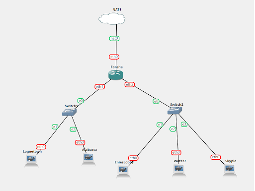 </p>

## 1. EniesLobby akan dijadikan sebagai DNS Master, Water7 akan dijadikan DNS Slave, dan Skypie akan digunakan sebagai Web Server. Terdapat 2 Client yaitu Loguetown, dan Alabasta. Semua node terhubung pada router Foosha, sehingga dapat mengakses internet.
Struktur node untuk masing-masing dibuat file di `/root/autorun.sh`
```bash
# Foosha
iptables -t nat -A POSTROUTING -o eth0 -j MASQUERADE -s 10.31.0.0/16

# Loguetown
echo "nameserver 192.168.122.1" > /etc/resolv.conf
apt-get update
apt-get install nano

# Alabasta
echo "nameserver 192.168.122.1" > /etc/resolv.conf
apt-get update
apt-get install nano

# EniesLobby
echo "nameserver 192.168.122.1" > /etc/resolv.conf
apt-get update
apt-get install nano

# Water7
echo "nameserver 192.168.122.1" > /etc/resolv.conf
apt-get update
apt-get install nano

# Skypie
echo "nameserver 192.168.122.1" > /etc/resolv.conf
apt-get update
apt-get install nano
```

## 2. Luffy ingin menghubungi Franky yang berada di EniesLobby dengan denden mushi. Kalian diminta Luffy untuk membuat website utama dengan mengakses `franky.yyy.com` dengan alias `www.franky.yyy.com` pada folder kaizoku.
**Enieslobby** `/root/autorunfile/named.conf.local`

```bash
zone "franky.e04.com" {
    type master;
    notify yes;
    also-notify { 10.31.2.3; }; // Masukan IP Water7 tanpa tanda petik
    allow-transfer { 10.31.2.3; }; // Masukan IP Water7 tanpa tanda petik
    file "/etc/bind/kaizoku/franky.e04.com";
};
```

Nanti setiap Enieslobby booting, akan dipanggil command

`cp /root/autorunfile/named.conf.local /etc/bind/named.conf.local`

**Enieslobby** `/root/autorunfile/franky.e04.com`

```bash
;
; BIND data file for local loopback interface
;
$TTL    604800
@       IN      SOA     franky.e04.com. root.franky.e04.com. (
                     2021100401         ; Serial
                         604800         ; Refresh
                          86400         ; Retry
                        2419200         ; Expire
                         604800 )       ; Negative Cache TTL
;
@       IN      NS      franky.e04.com.
@       IN      A       10.31.2.4
www     IN      CNAME   franky.e04.com.
```

Nanti setiap Enieslobby booting, akan dipanggil command

`cp /root/autorunfile/franky.e04.com /etc/bind/kaizoku/franky.e04.com`

Hasilnya adalah sebagai berikut ketika diakses dari EniesLobby
<p align="center"> 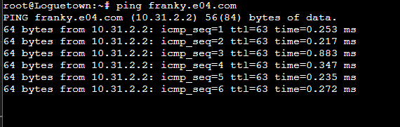 </p>

## 3. Setelah itu buat subdomain super.franky.yyy.com dengan alias `www.super.franky.yyy.com` yang diatur DNS nya di EniesLobby dan mengarah ke Skypie.
**Enieslobby** `/root/autorunfile/franky.e04.com`

```bash
;
; BIND data file for local loopback interface
;
$TTL    604800
@       IN      SOA     franky.e04.com. root.franky.e04.com. (
                     2021100401         ; Serial
                         604800         ; Refresh
                          86400         ; Retry
                        2419200         ; Expire
                         604800 )       ; Negative Cache TTL
;
@         IN      NS      franky.e04.com.
@         IN      A       10.31.2.4
www       IN      CNAME   franky.e04.com.
super     IN      A       10.31.2.4
www.super IN      CNAME   super.franky.e04.com.
```

Nanti setiap Enieslobby booting, akan dipanggil command

`cp /root/autorunfile/franky.e04.com /etc/bind/kaizoku/franky.e04.com`

Setelah di restart bindnya, lalu diuji coba, hasilnya sebagai berikut:
<p align="center"> 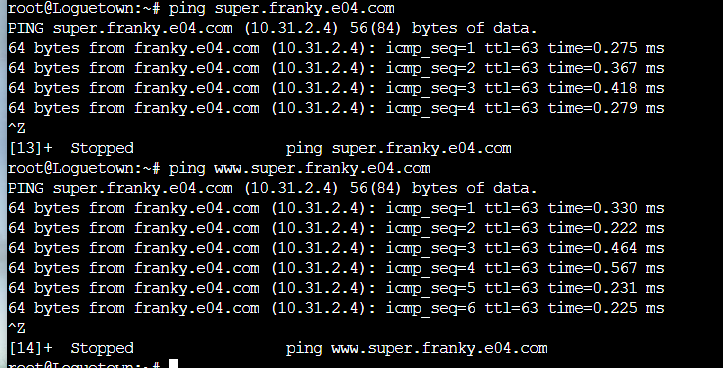 </p>

## 4. Buat juga reverse domain untuk domain utama
Edit file di:
**Enieslobby** `/root/autorunfile/named.conf.local`

```bash
zone "franky.e04.com" {
    type master;
    notify yes;
    also-notify { 10.31.2.3; }; // Masukan IP Water7 tanpa tanda petik
    allow-transfer { 10.31.2.3; }; // Masukan IP Water7 tanpa tanda petik
    file "/etc/bind/kaizoku/franky.e04.com";
};

zone "2.31.10.in-addr.arpa" {
    type master;
    file "/etc/bind/kaizoku/2.31.10.in-addr.arpa";
};
```

Nanti setiap Enieslobby booting, akan dipanggil command

`cp /root/autorunfile/named.conf.local /etc/bind/named.conf.local`

Dan buat file autorun baru

**Enieslobby** `/root/autorunfile/2.31.10.in-addr.arpa`

```bash
;
; BIND data file for local loopback interface
;
$TTL    604800
@       IN      SOA     franky.e04.com. root.franky.e04.com. (
                     2021100401         ; Serial
                         604800         ; Refresh
                          86400         ; Retry
                        2419200         ; Expire
                         604800 )       ; Negative Cache TTL
;
2.31.10.in-addr.arpa.    IN      NS      franky.e04.com.
2                        IN      PTR	 franky.e04.com.
```

Nanti setiap **Enieslobby** booting, akan dipanggil command

`cp /root/autorunfile/2.31.10.in-addr.arpa /etc/bind/kaizoku/2.31.10.in-addr.arpa`

Selanjutnya dipastikan megunakan `host -t PTR 10.31.2.2` sebagai berikut:
<p align="center"> 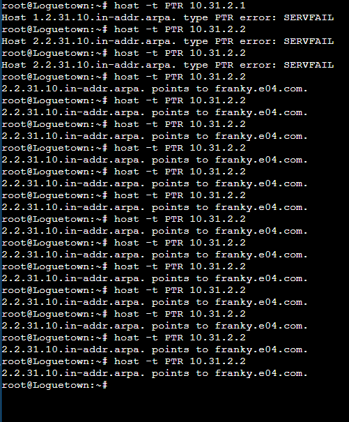 </p>

Note:
Ada satu masalah yang cukup unik dimana kami sudah melakukan konfigurasi di `/etc/bind/kaizoku/2.31.10.in-addr.arpa`
dengan benar, setelahnya kami melakukan restart bind terus menerus layaknya pengguna Provider Plat Merah yang senantiasa setia merestart modemnya namun tidak kunjung menemukan solusi. Tetapi saat kita mengetik ulang lalu kita restart lagi, tiba2 keajaiban muncul, lalu kita coba kembali konfigurasi yang sama seperti saat error tiba2 keajaiban kedua terjadi. Sungguh *epicos momentos* di soal shift kali ini.

## 5. Supaya tetap bisa menghubungi Franky jika server EniesLobby rusak, maka buat Water7 sebagai DNS Slave untuk domain utama.
Pada **Water7** kita ganti nameservernya dengan nameserver dengan script sebagai berikut:

```bash
echo "nameserver 10.31.2.2" > /etc/resolv.conf
echo "nameserver 10.31.2.3" >> /etc/resolv.conf
```

Pada **EniesLobby** sudah disetting slavenya. Kemudian pada Water7, kita buat konfigurasinya sebagai berikut:

**Water7** `/root/autorunfile/named.conf.local`

```bash
zone "franky.e04.com" {
    type slave;
    masters { 10.31.2.2; }; // Masukan IP EniesLobby tanpa tanda petik
    file "/var/lib/bind/franky.e04.com";
};
```

Nanti setiap **Water7** booting, akan dipanggil command

`cp /root/autorunfile/named.conf.local /etc/bind/named.conf.local`

Setelah mematikan service bind di EniesLobby dan menghidupkan service bind Water7 hasil test ping di Loguetown adalah sebagai berikut:
<p align="center"> 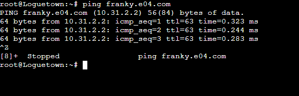 </p>

## 6. Setelah itu terdapat subdomain `mecha.franky.yyy.com` dengan alias `www.mecha.franky.yyy.com` yang didelegasikan dari EniesLobby ke Water7 dengan IP menuju ke Skypie dalam folder sunnygo.
Kemudian kita tambahkan DNS record pada

**Enieslobby** `/root/autorunfile/franky.e04.com`

```bash
;
; BIND data file for local loopback interface
;
$TTL    604800
@       IN      SOA     franky.e04.com. root.franky.e04.com. (
                     2021100401         ; Serial
                         604800         ; Refresh
                          86400         ; Retry
                        2419200         ; Expire
                         604800 )       ; Negative Cache TTL
;
@         IN      NS      franky.e04.com.
@         IN      A       10.31.2.4
www       IN      CNAME   franky.e04.com.
super     IN      A       10.31.2.4
www.super IN      CNAME   super.franky.e04.com.
mecha     IN      NS      ns1
```

`cp /root/autorunfile/franky.e04.com /etc/bind/kaizoku/franky.e04.com`

Dan pada **Enieslobby** `/etc/bind/named.conf.options` tambah `allow-query{any;}`

```bash
options {
        directory "/var/cache/bind";

        // If there is a firewall between you and nameservers you want
        // to talk to, you may need to fix the firewall to allow multiple
        // ports to talk.  See http://www.kb.cert.org/vuls/id/800113

        // If your ISP provided one or more IP addresses for stable 
        // nameservers, you probably want to use them as forwarders.  
        // Uncomment the following block, and insert the addresses replacing 
        // the all-0's placeholder.

        // forwarders {
        //      0.0.0.0;
        // };

        //========================================================================
        // If BIND logs error messages about the root key being expired,
        // you will need to update your keys.  See https://www.isc.org/bind-keys
        //========================================================================
        dnssec-validation auto;

        allow-query{any;};
        auth-nxdomain no;    # conform to RFC1035
        listen-on-v6 { any; };
};
```

Agar terload pada saat booting. maka kita simpan ke dalam `/root/autorunfile/named.conf.options`

Lalu setiap booting jalankan

`cp /root/autorunfile/named.conf.options /etc/bind/named.conf.options`  

Kemudian pada **Water7** `/etc/bind/named.conf.local`

Kita tambahkan delegasinya

```bash
zone "franky.e04.com" {
    type slave;
    masters { 10.31.2.2; }; // Masukan IP EniesLobby tanpa tanda petik
    file "/var/lib/bind/franky.e04.com";
};

zone "mecha.franky.e04.com" {
    type master;
    file "/etc/bind/sunnygo/mecha.franky.e04.com";
};
```

Dan disimpan juga ke `/root/autorunfile/named.conf.local` dan dijalankan setiap kali booting

`cp /root/autorunfile/named.conf.local /etc/bind/named.conf.local`

Dan pada **Water7** `/etc/bind/named.conf.options` tambah `allow-query{any;}`

```bash
options {
        directory "/var/cache/bind";

        // If there is a firewall between you and nameservers you want
        // to talk to, you may need to fix the firewall to allow multiple
        // ports to talk.  See http://www.kb.cert.org/vuls/id/800113

        // If your ISP provided one or more IP addresses for stable 
        // nameservers, you probably want to use them as forwarders.  
        // Uncomment the following block, and insert the addresses replacing 
        // the all-0's placeholder.

        // forwarders {
        //      0.0.0.0;
        // };

        //========================================================================
        // If BIND logs error messages about the root key being expired,
        // you will need to update your keys.  See https://www.isc.org/bind-keys
        //========================================================================
        //dnssec-validation auto;

        allow-query{any;};
        auth-nxdomain no;    # conform to RFC1035
        listen-on-v6 { any; };
};
```

Agar terload pada saat booting. maka kita simpan ke dalam `/root/autorunfile/named.conf.options`

Lalu setiap booting jalankan

`cp /root/autorunfile/named.conf.options /etc/bind/named.conf.options`  

Kemudian buat file di 

**Water7** `/root/autorunfile/mecha.franky.e04.com`

```bash
;
; BIND data file for local loopback interface
;
$TTL    604800
@       IN      SOA     mecha.franky.e04.com. root.mecha.franky.e04.com. (
                              2021100401                ; Serial
                         604800         ; Refresh
                          86400         ; Retry
                        2419200         ; Expire
                         604800 )       ; Negative Cache TTL
;
@       IN      NS      mecha.franky.e04.com.
@       IN      A       10.31.2.4
www     IN      CNAME   mecha.franky.e04.com.
```

Dan setiap booting jalankan

`cp /root/autorunfile/mecha.franky.e04.com /etc/bind/sunnygo/mecha.franky.e04.com`

`ping **[mecha.franky.e04.com](http://mecha.franky.e04.com)**`

## 7. Untuk memperlancar komunikasi Luffy dan rekannya, dibuatkan subdomain melalui Water7 dengan nama `general.mecha.franky.yyy.com` dengan alias `www.general.mecha.franky.yyy.com` yang mengarah ke Skypie.
Pada **Water7** `/root/autorunfile/mecha.franky.e04.com` ditambahkan 2 baris baru untuk menambah subdomain.

```bash
;
; BIND data file for local loopback interface
;
$TTL    604800
@       IN      SOA     mecha.franky.e04.com. root.mecha.franky.e04.com. (
                              2021100401                ; Serial
                         604800         ; Refresh
                          86400         ; Retry
                        2419200         ; Expire
                         604800 )       ; Negative Cache TTL
;
@               IN      NS      mecha.franky.e04.com.
@               IN      A       10.31.2.4
www             IN      CNAME   mecha.franky.e04.com.
general         IN      A       10.31.2.4
www.general     IN      CNAME   general.mecha.franky.e04.com.
```

## 8. Setelah melakukan konfigurasi server, maka dilakukan konfigurasi Webserver. Pertama dengan webserver `www.franky.yyy.com.` Pertama, luffy membutuhkan webserver dengan DocumentRoot pada `/var/www/franky.yyy.com`.
Install apache2 dan php pada Webserver yaitu Skypie. Masukan perintah kedalam script.

```bash
echo "nameserver 192.168.122.1" > /etc/resolv.conf
apt-get update
apt-get install nano
apt-get install apache2
apt-get install php
apt-get install libapache2-mod-php7.0
```

Buat config file **franky.e04.com.conf** menggunakan template **000-default.conf** dari apache2. Lalu ganti path DocumentRoot nya sesuai soal.

Skypie `/autorunfile/franky.e04.com.conf`

```bash
<VirtualHost *:80>
        # The ServerName directive sets the request scheme, hostname and port that
        # the server uses to identify itself. This is used when creating
        # redirection URLs. In the context of virtual hosts, the ServerName
        # specifies what hostname must appear in the request's Host: header to
        # match this virtual host. For the default virtual host (this file) this
        # value is not decisive as it is used as a last resort host regardless.
        # However, you must set it for any further virtual host explicitly.
        #ServerName www.example.com

				# Soal 8
        ServerAdmin webmaster@localhost
        DocumentRoot /var/www/franky.e04.com
				ServerName franky.e04.com
				ServerAlias www.franky.e04.com

        # Available loglevels: trace8, ..., trace1, debug, info, notice, warn,
        # error, crit, alert, emerg.
        # It is also possible to configure the loglevel for particular
        # modules, e.g.
        #LogLevel info ssl:warn

        ErrorLog ${APACHE_LOG_DIR}/error.log
        CustomLog ${APACHE_LOG_DIR}/access.log combined

        # For most configuration files from conf-available/, which are
        # enabled or disabled at a global level, it is possible to
        # include a line for only one particular virtual host. For example the
        # following line enables the CGI configuration for this host only
        # after it has been globally disabled with "a2disconf".
        #Include conf-available/serve-cgi-bin.conf
</VirtualHost>

# vim: syntax=apache ts=4 sw=4 sts=4 sr noet
```

Lalu Script untuk Skypie ditambahkan menjadi seperti berikut, (melakukan copy config ke dir apache2)

```bash
echo "nameserver 192.168.122.1" > /etc/resolv.conf
apt-get update
apt-get install nano
apt-get install apache2
apt-get install php
apt-get install libapache2-mod-php7.0

# copy file hasil unzip
cp /root/franky.e04.com /var/www/

# copy config webserver
cp autorunfile/franky.e04.com.conf /etc/apache2/sites-available/franky.e04.com.conf
a2ensite franky.e04.com
service apache2 restart
```

## 9. Setelah itu, Luffy juga membutuhkan agar url `www.franky.yyy.com/index.php/`home dapat menjadi menjadi `www.franky.yyy.com/home`.
Menambah Alias pada **franky.e04.com.conf** ketika mengakses  [**www.franky.yyy.com/home**](http://www.franky.com/home).

```bash
Alias "/home" "var/www/franky.e04.com/index.php"
```

Lalu restart apache.

## 10. Setelah itu, pada subdomain `www.super.franky.yyy.com`, Luffy membutuhkan penyimpanan aset yang memiliki DocumentRoot pada `/var/www/super.franky.yyy.com`.
Buat config untuk **super.franky.e04.com**

```bash
<VirtualHost *:80>
        # The ServerName directive sets the request scheme, hostname and port that
        # the server uses to identify itself. This is used when creating
        # redirection URLs. In the context of virtual hosts, the ServerName
        # specifies what hostname must appear in the request's Host: header to
        # match this virtual host. For the default virtual host (this file) this
        # value is not decisive as it is used as a last resort host regardless.
        # However, you must set it for any further virtual host explicitly.
        #ServerName www.example.com

				# Soal 10
        ServerAdmin webmaster@localhost
        DocumentRoot /var/www/super.franky.e04.com
				ServerName super.franky.e04.com
				ServerAlias www.super.franky.e04.com

        # Available loglevels: trace8, ..., trace1, debug, info, notice, warn,
        # error, crit, alert, emerg.
        # It is also possible to configure the loglevel for particular
        # modules, e.g.
        #LogLevel info ssl:warn

        ErrorLog ${APACHE_LOG_DIR}/error.log
        CustomLog ${APACHE_LOG_DIR}/access.log combined

        # For most configuration files from conf-available/, which are
        # enabled or disabled at a global level, it is possible to
        # include a line for only one particular virtual host. For example the
        # following line enables the CGI configuration for this host only
        # after it has been globally disabled with "a2disconf".
        #Include conf-available/serve-cgi-bin.conf
</VirtualHost>

# vim: syntax=apache ts=4 sw=4 sts=4 sr noet
```

Download asset dan pindahkan ke **/var/www** menggunakan script berikut.

```bash
# Script untuk Skyipie
mv /root/super.franky/super.franky /root/super.franky.e04.com
cp -r /root/super.franky.e04.com /var/www/
```

Sehingga hasil lynx.
<p align="center"> 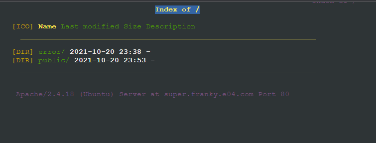 </p>

## 11. Akan tetapi, pada folder `/public`, Luffy ingin hanya dapat melakukan directory listing saja.
Ubah file config untuk **super.franky.e04.com.conf** Menjadi listing untuk **/public** saja. Dan disable indexes untuk tiap folder pada public.

```bash
<VirtualHost *:80>
		...
	
		    <Directory /var/www/super.franky.e04.com/public/*>
                Options -Indexes
        </Directory>

        <Directory /var/www/super.franky.e04.com/public>
                Options +Indexes
        </Directory>

		...
</VirtualHost>

# vim: syntax=apache ts=4 sw=4 sts=4 sr noet
```

## 12. Tidak hanya itu, Luffy juga menyiapkan error file 404.html pada folder `/error` untuk mengganti error kode pada apache.
Tambahkan satu line code pada config **super.franky.e04.com.conf**

```bash
<VirtualHost *:80>
		...
	
			ErrorDocument 404 /error/404.html

		...
</VirtualHost>

# vim: syntax=apache ts=4 sw=4 sts=4 sr noet
```

## 13. Luffy juga meminta Nami untuk dibuatkan konfigurasi virtual host. Virtual host ini bertujuan untuk dapat mengakses file asset `www.super.franky.yyy.com/public/js` menjadi `www.super.franky.yyy.com/js`.
Kita tambahkan alias di file berikut:

**Skypie** `/root/autorunfile/super.franky.e04.com.conf`

```bash
<VirtualHost *:80>
        # The ServerName directive sets the request scheme, hostname and port that
        # the server uses to identify itself. This is used when creating
        # redirection URLs. In the context of virtual hosts, the ServerName
        # specifies what hostname must appear in the request's Host: header to
        # match this virtual host. For the default virtual host (this file) this
        # value is not decisive as it is used as a last resort host regardless.
        # However, you must set it for any further virtual host explicitly.
        ServerName super.franky.e04.com
        ServerAlias www.super.franky.e04.com

        ServerAdmin webmaster@localhost
        DocumentRoot /var/www/super.franky.e04.com

				<Directory /var/www/super.franky.e04.com>
                Options +Indexes
        </Directory>

        <Directory /var/www/super.franky.e04.com/public>
                Options +Indexes
        </Directory>

        # Available loglevels: trace8, ..., trace1, debug, info, notice, warn,
        # error, crit, alert, emerg.
        # It is also possible to configure the loglevel for particular
        # modules, e.g.
        #LogLevel info ssl:warn

        ErrorLog ${APACHE_LOG_DIR}/error.log
        CustomLog ${APACHE_LOG_DIR}/access.log combined
        
        ErrorDocument 404 /error/404.html

        Alias "/js" "/var/www/super.franky.e04.com/public/js"

        # For most configuration files from conf-available/, which are
        # enabled or disabled at a global level, it is possible to
        # include a line for only one particular virtual host. For example the
        # following line enables the CGI configuration for this host only
        # after it has been globally disabled with "a2disconf".
        #Include conf-available/serve-cgi-bin.conf
</VirtualHost>

# vim: syntax=apache ts=4 sw=4 sts=4 sr noet
```

Nanti setiap **Skypie** booting, akan dipanggil command

`cp /root/autorunfile/super.franky.e04.com.conf /etc/apache2/sites-available/super.franky.e04.com.conf`

Setelah di cek http:// /js

<p align="center"> 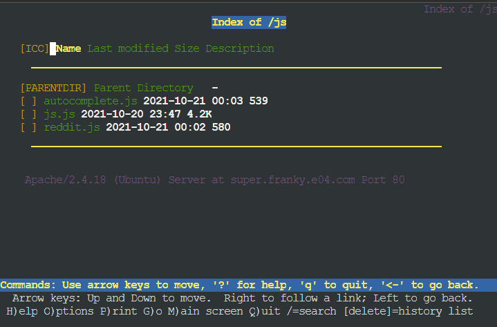 </p>

## 14. Dan Luffy meminta untuk web `www.general.mecha.franky.yyy.com` hanya bisa diakses dengan `port 15000` dan `port 15500`
Pertama-tama siapkan webserver untuk `general.mecha.franky.e04.com`

**Skypie** `/root/autorunfile/general.mecha.franky.e04.com.conf`

```bash
<VirtualHost *:80>
        # The ServerName directive sets the request scheme, hostname and port that
        # the server uses to identify itself. This is used when creating
        # redirection URLs. In the context of virtual hosts, the ServerName
        # specifies what hostname must appear in the request's Host: header to
        # match this virtual host. For the default virtual host (this file) this
        # value is not decisive as it is used as a last resort host regardless.
        # However, you must set it for any further virtual host explicitly.
        ServerName general.mecha.franky.e04.com
        ServerAlias www.general.mecha.franky.e04.com

        ServerAdmin webmaster@localhost
        DocumentRoot /var/www/general.mecha.franky.e04

        # Available loglevels: trace8, ..., trace1, debug, info, notice, warn,
        # error, crit, alert, emerg.
        # It is also possible to configure the loglevel for particular
        # modules, e.g.
        #LogLevel info ssl:warn

        ErrorLog ${APACHE_LOG_DIR}/error.log
        CustomLog ${APACHE_LOG_DIR}/access.log combined

        # For most configuration files from conf-available/, which are
        # enabled or disabled at a global level, it is possible to
        # include a line for only one particular virtual host. For example the
        # following line enables the CGI configuration for this host only
        # after it has been globally disabled with "a2disconf".
        #Include conf-available/serve-cgi-bin.conf
</VirtualHost>

# vim: syntax=apache ts=4 sw=4 sts=4 sr noet
```

`cp /root/autorunfile/general.mecha.franky.e04.com.conf /etc/apache2/sites-available/general.mecha.franky.e04.com.conf`

Dan

`a2ensite general.mecha.franky.e04.com.conf`

Untuk port 15000 confignya adalah sebagai berikut

**Skypie** `/root/autorunfile/general.mecha.e04.com-15000.conf`

```bash
<VirtualHost *:15000>
        ServerName general.mecha.franky.e04.com
        ServerAlias www.general.mecha.franky.e04.com

        ServerAdmin webmaster@localhost
        DocumentRoot /var/www/general.mecha.franky.e04

        ErrorLog ${APACHE_LOG_DIR}/error.log
        CustomLog ${APACHE_LOG_DIR}/access.log combined
</VirtualHost>
```

Nanti setiap **Skypie** booting, akan dipanggil command

`cp /root/autorunfile/general.mecha.e04.com-15000.conf /etc/apache2/sites-available/general.mecha.e04.com-15000.conf`

Dan

`a2ensite`  

Untuk port 15500 confignya adalah sebagai berikut

**Skypie** `/root/autorunfile/general.mecha.e04.com-15500.conf`

```bash
<VirtualHost *:15500>
        ServerName general.mecha.franky.e04.com
        ServerAlias www.general.mecha.franky.e04.com

        ServerAdmin webmaster@localhost
        DocumentRoot /var/www/general.mecha.franky.e04

        ErrorLog ${APACHE_LOG_DIR}/error.log
        CustomLog ${APACHE_LOG_DIR}/access.log combined
</VirtualHost>
```

Nanti setiap **Skypie** booting, akan dipanggil command

`cp /root/autorunfile/general.mecha.e04.com-15500.conf /etc/apache2/sites-available/general.mecha.e04.com-15500.conf`

Lalu untuk file port confignya

**Skypie** `/root/autorunfile/ports.conf`

```bash
Listen 80
Listen 15000
Listen 15500

<IfModule ssl_module>
        Listen 443
</IfModule>

<IfModule mod_gnutls.c>
        Listen 443
</IfModule>
```

Dan nanti setiap dibooting

`cp /root/autorunfile/ports.conf /etc/apache2/ports.conf`

Dicheck port 15000:
<p align="center"> 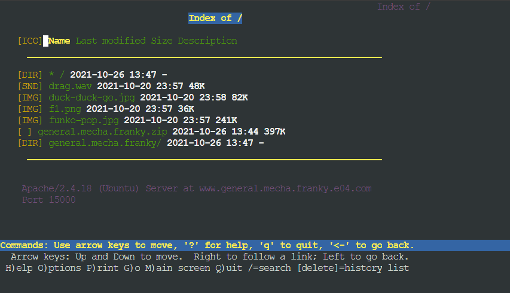 </p>

Port 15500:
<p align="center"> 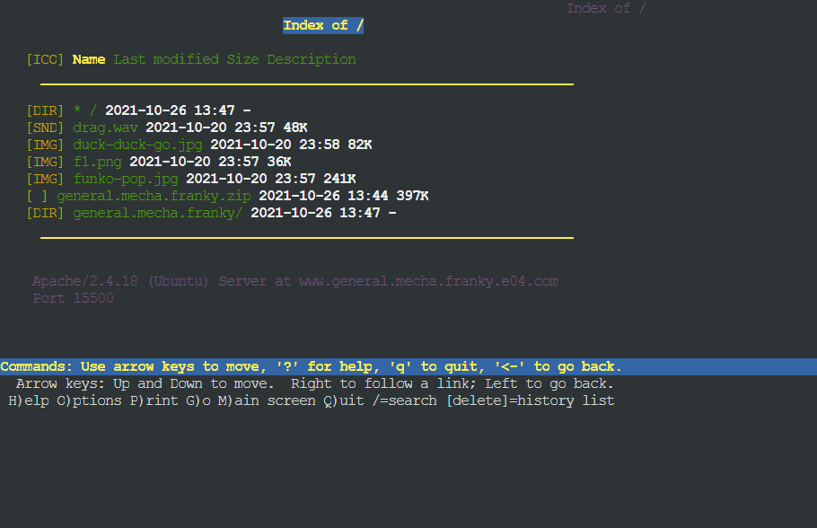 </p>

## 15. dengan autentikasi username luffy dan password onepiece dan file di `/var/www/general.mecha.franky.yyy`
Buat usernya

```bash
htpasswd -c /etc/apache2/.htpasswd luffy
```

<p align="center"> 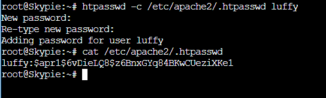 </p>

Selanjutnya kita impan file tersebut ke root, dan setiap booting akan dicopy kembali ke tempat asalnya. Disini kita simpan di /root/autorunfile/.htpasswd

dan setiap kali booting

`cp /root/autorunfile/.htpasswd /etc/apache2/.htpasswd` 

Kemudian pada config port 15000 diubah sebagai berikut:

```bash
<VirtualHost *:15000>
        ServerName general.mecha.franky.e04.com
        ServerAlias www.general.mecha.franky.e04.com

        ServerAdmin webmaster@localhost
        DocumentRoot /var/www/general.mecha.franky.e04

        ErrorLog ${APACHE_LOG_DIR}/error.log
        CustomLog ${APACHE_LOG_DIR}/access.log combined
        
        <Directory "var/www/general.mecha.franky.e04">
                AuthType Basic
                AuthName "Restricted Content"
                AuthUserFile /etc/apache2/.htpasswd
                Require valid-user
        </Directory>
</VirtualHost>
```

Nanti setiap **Skypie** booting, akan dipanggil command

`cp /root/autorunfile/general.mecha.e04.com-15000.conf /etc/apache2/sites-available/general.mecha.e04.com-15000.conf`

Kemudian pada config port 15500 diubah sebagai berikut:

**Skypie** `/root/autorunfile/general.mecha.e04.com-15500.conf`

```bash
<VirtualHost *:15500>
        ServerName general.mecha.franky.e04.com
        ServerAlias www.general.mecha.franky.e04.com

        ServerAdmin webmaster@localhost
        DocumentRoot /var/www/general.mecha.franky.e04

        ErrorLog ${APACHE_LOG_DIR}/error.log
        CustomLog ${APACHE_LOG_DIR}/access.log combined
        
        <Directory "var/www/general.mecha.franky.e04">
                AuthType Basic
                AuthName "Restricted Content"
                AuthUserFile /etc/apache2/.htpasswd
                Require valid-user
        </Directory>
</VirtualHost>
```

Nanti setiap **Skypie** booting, akan dipanggil command

`cp /root/autorunfile/general.mecha.e04.com-15500.conf /etc/apache2/sites-available/general.mecha.e04.com-15500.conf`

Kemudian autentifikasi yg terjadi adalah berikut:
<p align="center"> 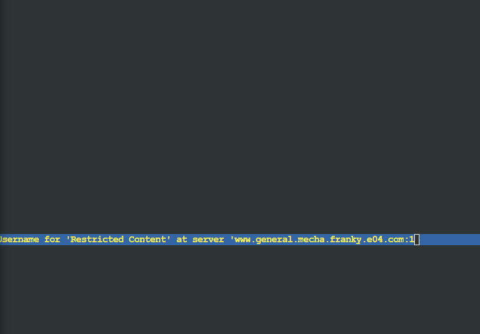 </p>

## 16. Dan setiap kali mengakses IP Skypie akan dialihkan secara otomatis ke `www.franky.yyy.com`
Kemudian file .htaccessnya

```bash
RewriteEngine On
RewriteBase /
RewriteCond %{HTTP_HOST} ^10\.31\.2\.4$
RewriteRule ^(.*)$ http://www.franky.e04.com/$1 [L,R=301]
```

dan setiap booting dicopy ke

`cp /root/autorunfile/.htaccess /var/www/html/franky.e04.com/.htaccess`.

Kemudian pada site defaultnya `/root/autorunfile/000-default.conf`

```bash
<VirtualHost *:80>
        # The ServerName directive sets the request scheme, hostname and port that
        # the server uses to identify itself. This is used when creating
        # redirection URLs. In the context of virtual hosts, the ServerName
        # specifies what hostname must appear in the request's Host: header to
        # match this virtual host. For the default virtual host (this file) this
        # value is not decisive as it is used as a last resort host regardless.
        # However, you must set it for any further virtual host explicitly.
        #ServerName www.example.com

        ServerAdmin webmaster@localhost
        DocumentRoot /var/www/html/franky.e04.com

        # Available loglevels: trace8, ..., trace1, debug, info, notice, warn,
        # error, crit, alert, emerg.
        # It is also possible to configure the loglevel for particular
        # modules, e.g.
        #LogLevel info ssl:warn

        ErrorLog ${APACHE_LOG_DIR}/error.log
        CustomLog ${APACHE_LOG_DIR}/access.log combined

        # For most configuration files from conf-available/, which are
        # enabled or disabled at a global level, it is possible to
        # include a line for only one particular virtual host. For example the
        # following line enables the CGI configuration for this host only
        # after it has been globally disabled with "a2disconf".
        #Include conf-available/serve-cgi-bin.conf
</VirtualHost>

# vim: syntax=apache ts=4 sw=4 sts=4 sr noet
```

dan setiap booting dicopy ke

`cp /root/autorunfile/000-default.conf /etc/apache2/sites-available/000-default.conf`.

Dan setelah ditest hasilnya sebagai berikut:

```bash
lynx 10.31.2.4
```

<p align="center"> 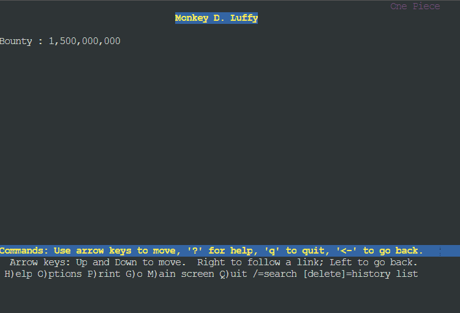 </p>

## 17. Dikarenakan Franky juga ingin mengajak temannya untuk dapat menghubunginya melalui website `www.super.franky.yyy.com`, dan dikarenakan pengunjung web server pasti akan bingung dengan randomnya images yang ada, maka Franky juga meminta untuk mengganti request gambar yang memiliki substring “franky” akan diarahkan menuju `franky.png`. Maka bantulah Luffy untuk membuat konfigurasi dns dan web server ini!
Kemudian .htacces untuk di [super.franky.e04.com](http://super.franky.e04.com) adalah sebagai berikut:

/root/autorunfile/.htaccess-superfranky

```bash
RewriteEngine On
RewriteBase /
RewriteCond %{REQUEST_URI} !\bfranky.png\b
RewriteRule franky http://super.franky.e04.com/public/images/franky.png$1 [L,R=301]
```

`cp /root/autorunfile/.htaccess-superfranky /var/www/super.franky.e04.com/.htaccess`

Kemudian pada config `super.franky.e04.com.conf`

```bash
<VirtualHost *:80>
        # The ServerName directive sets the request scheme, hostname and port that
        # the server uses to identify itself. This is used when creating
        # redirection URLs. In the context of virtual hosts, the ServerName
        # specifies what hostname must appear in the request's Host: header to
        # match this virtual host. For the default virtual host (this file) this
        # value is not decisive as it is used as a last resort host regardless.
        # However, you must set it for any further virtual host explicitly.
        ServerName super.franky.e04.com
        ServerAlias www.super.franky.e04.com

        ServerAdmin webmaster@localhost
        DocumentRoot /var/www/super.franky.e04.com

        <Directory /var/www/super.franky.e04.com>
                Options +Indexes
                AllowOverride All
        </Directory>

        <Directory /var/www/super.franky.e04.com/public>
                Options +Indexes
        </Directory>

        # Available loglevels: trace8, ..., trace1, debug, info, notice, warn,
        # error, crit, alert, emerg.
        # It is also possible to configure the loglevel for particular
        # modules, e.g.
        #LogLevel info ssl:warn

        ErrorLog ${APACHE_LOG_DIR}/error.log
        CustomLog ${APACHE_LOG_DIR}/access.log combined
        
        ErrorDocument 404 /error/404.html

        Alias "/js" "/var/www/super.franky.e04.com/public/js"

        # For most configuration files from conf-available/, which are
        # enabled or disabled at a global level, it is possible to
        # include a line for only one particular virtual host. For example the
        # following line enables the CGI configuration for this host only
        # after it has been globally disabled with "a2disconf".
        #Include conf-available/serve-cgi-bin.conf
</VirtualHost>

# vim: syntax=apache ts=4 sw=4 sts=4 sr noet
```

Nanti setiap **Skypie** booting, akan dipanggil command

`cp /root/autorunfile/super.franky.e04.com.conf /etc/apache2/sites-available/super.franky.e04.com.conf`

Kemudian dicoba lynx [http://www.super.franky.e04.com/ilhamfrankygod](http://www.super.franky.e04.com/ilhamfrankygod) . Langsung di redirect ke berikut:
<p align="center"> 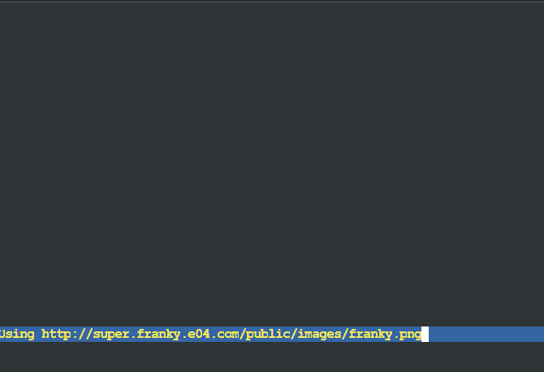 </p>