# Jarkom-Modul-3-E04-2021

## Kelompok E04

1. I Kadek Agus Ariesta Putra 05111940000105
2. Axel Briano Suherik 05111940000137
3. Timotius Wirawan 05111940000161

## Pembagian Pengerjaan Soal Praktikum
- No. 1-5: Axel Briano Suherik
- No. 6-9: Timotius Wirawan
- No.10-13: I Kadek Agus Ariesta Putra

# Soal
Luffy yang sudah menjadi Raja Bajak Laut ingin mengembangkan daerah kekuasaannya dengan membuat peta seperti berikut:

<p align="center"> 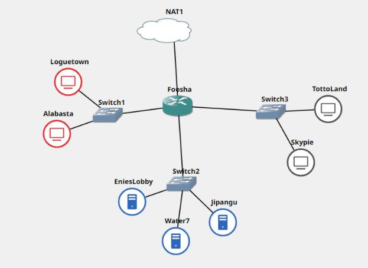 </p>

Luffy bersama Zoro berencana membuat peta tersebut dengan kriteria EniesLobby sebagai DNS Server, Jipangu sebagai DHCP Server, Water7 sebagai Proxy Server (1), dan Foosha sebagai DHCP Relay (2). Luffy dan Zoro menyusun peta tersebut dengan hati-hati dan teliti.

Ada beberapa kriteria yang ingin dibuat oleh Luffy dan Zoro, yaitu:
Semua client yang ada HARUS menggunakan konfigurasi IP dari DHCP Server.
Client yang melalui Switch1 mendapatkan range IP dari [prefix IP].1.20 - [prefix IP].1.99 dan [prefix IP].1.150 - [prefix IP].1.169 (3)
Client yang melalui Switch3 mendapatkan range IP dari [prefix IP].3.30 - [prefix IP].3.50 (4)
Client mendapatkan DNS dari EniesLobby dan client dapat terhubung dengan internet melalui DNS tersebut. (5)
Lama waktu DHCP server meminjamkan alamat IP kepada Client yang melalui Switch1 selama 6 menit sedangkan pada client yang melalui Switch3 selama 12 menit. Dengan waktu maksimal yang dialokasikan untuk peminjaman alamat IP selama 120 menit. (6)
	
Luffy dan Zoro berencana menjadikan Skypie sebagai server untuk jual beli kapal yang dimilikinya dengan alamat IP yang tetap dengan IP [prefix IP].3.69 (7). Loguetown digunakan sebagai client Proxy agar transaksi jual beli dapat terjamin keamanannya, juga untuk mencegah kebocoran data transaksi.

Pada Loguetown, proxy harus bisa diakses dengan nama jualbelikapal.yyy.com dengan port yang digunakan adalah 5000 (8). Agar transaksi jual beli lebih aman dan pengguna website ada dua orang, proxy dipasang autentikasi user proxy dengan enkripsi MD5 dengan dua username, yaitu luffybelikapalyyy dengan password luffy_yyy dan zorobelikapalyyy dengan password zoro_yyy (9). Transaksi jual beli tidak dilakukan setiap hari, oleh karena itu akses internet dibatasi hanya dapat diakses setiap hari Senin-Kamis pukul 07.00-11.00 dan setiap hari Selasa-Jum’at pukul 17.00-03.00 keesokan harinya (sampai Sabtu pukul 03.00) (10).

Agar transaksi bisa lebih fokus berjalan, maka dilakukan redirect website agar mudah mengingat website transaksi jual beli kapal. Setiap mengakses google.com, akan diredirect menuju super.franky.yyy.com dengan website yang sama pada soal shift modul 2. Web server super.franky.yyy.com berada pada node Skypie (11).

Saatnya berlayar! Luffy dan Zoro akhirnya memutuskan untuk berlayar untuk mencari harta karun di super.franky.yyy.com. Tugas pencarian dibagi menjadi dua misi, Luffy bertugas untuk mendapatkan gambar (.png, .jpg), sedangkan Zoro mendapatkan sisanya. Karena Luffy orangnya sangat teliti untuk mencari harta karun, ketika ia berhasil mendapatkan gambar, ia mendapatkan gambar dan melihatnya dengan kecepatan 10 kbps (12). Sedangkan, Zoro yang sangat bersemangat untuk mencari harta karun, sehingga kecepatan kapal Zoro tidak dibatasi ketika sudah mendapatkan harta yang diinginkannya (13).

Keterangan :
- yyy adalah nama kelompok Anda
- Untuk nomor 9, harus htpasswd yang melakukan enkripsi
- Bisa melakukan wget https://raw.githubusercontent.com/FeinardSlim/Praktikum-Modul-2-Jarkom/main/super.franky.zip untuk mendapatkan file untuk super.franky.yyy.com


# 1

### Luffy bersama Zoro berencana membuat peta tersebut dengan kriteria **EniesLobby** sebagai DNS Server, **Jipangu** sebagai DHCP Server, **Water7** sebagai Proxy Server

Script **EniesLobby**

```bash
echo "nameserver 192.168.122.1" > /etc/resolv.conf

apt-get update
apt-get install nano
apt-get install dnsutils -y

apt-get install bind9 -y
```

Script **Jipangu**

```bash
echo "nameserver 192.168.122.1" > /etc/resolv.conf

apt-get update
apt-get install nano
apt-get install isc-dhcp-server -y

# Copy dhcp config
cp ~/autorunfile/isc-dhcp-server /etc/default/isc-dhcp-server
service isc-dhcp-server restart
```

Config isc-dhcp-server

```bash
INTERFACES="eth0"
```

Script **Water7**

```bash
echo "nameserver 192.168.122.1" > /etc/resolv.conf

apt-get update
apt-get install squid
```

# 2

## **Foosha** sebagai DHCP Relay

Script **Foosha**

```bash
apt-get update
apt-get install nano
apt-get install isc-dhcp-relay

iptables -t nat -A POSTROUTING -o eth0 -j MASQUERADE -s 10.31.0.0/16

cp  ~/autorunfile/isc-dhcp-relay /etc/default
service isc-dhcp-relay restart
```

Config **dhcp-relay**

```bash
# What servers should the DHCP relay forward requests to?
SERVERS="10.31.2.4"

# On what interfaces should the DHCP relay (dhrelay) serve DHCP requests?
INTERFACES="eth1 eth2 eth3"
```

# 3

### Client yang melalui Switch1 mendapatkan range IP dari [prefix IP].1.20 - [prefix IP].1.99 dan [prefix IP].1.150 - [prefix IP].1.169

Setting setiap client Node (Alabasta, Loguetown, TottoLand, Skypie)  untuk menggunakan DHCP pada network nya

```bash
auto eth0
iface eth0 inet dhcp
```

**Jipangu** `/etc/dhcp/dhcpd.conf`

```bash
subnet 10.31.1.0 netmask 255.255.255.0 {
    range  10.31.1.20 10.31.1.99;
    range  10.31.1.150 10.31.1.169;
    option routers 10.31.1.1;
    option broadcast-address 10.31.1.255;
    option domain-name-servers 10.31.2.2;
    default-lease-time 360;
    max-lease-time 7200;
}
```

# 4

### Client yang melalui Switch3 mendapatkan range IP dari [prefix IP].3.30 - [prefix IP].3.50

**Jipangu** `/etc/dhcp/dhcpd.conf`

```bash
###

# Untuk subnet server server (2) EniesLobby, Water7, Jipangu
subnet 10.31.2.0 netmask 255.255.255.0 {
    option routers 10.31.2.1;
}

subnet 10.31.3.0 netmask 255.255.255.0 {
    range  10.31.3.30 10.31.3.50;
    option routers 10.31.3.1;
    option broadcast-address 10.31.3.255;
    option domain-name-servers 10.31.2.2;
    default-lease-time 720;
    max-lease-time 3600;
}

###
```

Cek menggunakan `ip a`

<p align="center"> 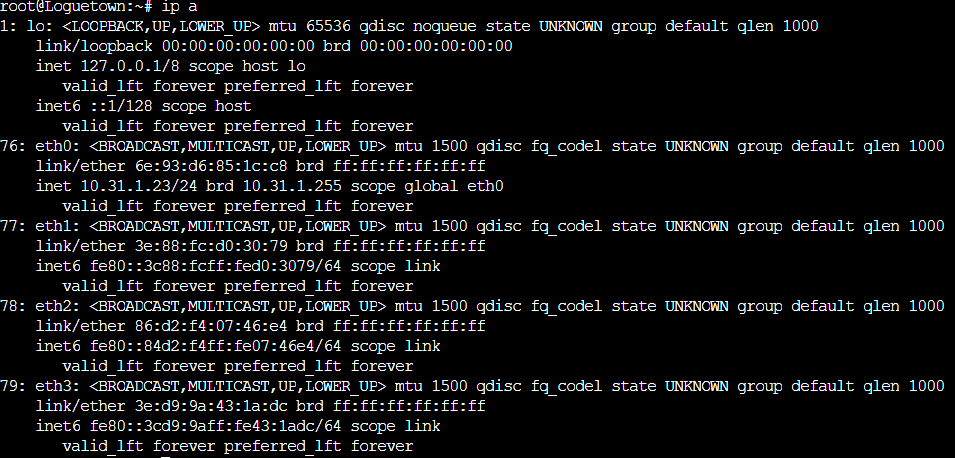 </p>

cek juga dengan `cat /etc/resolv.conf`

<p align="center"> 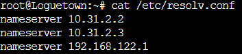 </p>

Pastikan configurasi network **Foosha** sudah terdapat 3 koneksi seperti berikut.

```bash
auto eth0
iface eth0 inet dhcp

auto eth1
iface eth1 inet static
	address 10.31.1.1
	netmask 255.255.255.0

auto eth2
iface eth2 inet static
	address 10.31.2.1
	netmask 255.255.255.0

auto eth3
iface eth3 inet static
	address 10.31.3.1
	netmask 255.255.255.0
```

# 5

### Client mendapatkan DNS dari EniesLobby dan client dapat terhubung dengan internet melalui DNS tersebut.

Sudah terdapat pada configurasi dhcp option `domain-name-servers x.x.x.x` .

Cek ifconfig pada **TottoLand**

<p align="center"> 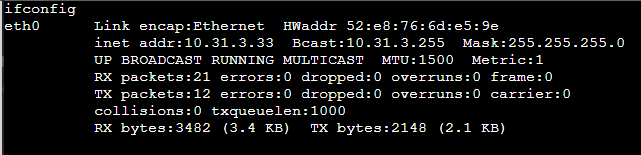 </p>

inet addr: 10.31.3.33 sudah dalam range pada setting dhcp server.

**Skypie**

<p align="center"> 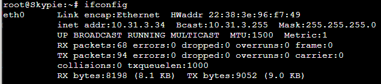 </p>

**Loguetown**

<p align="center"> 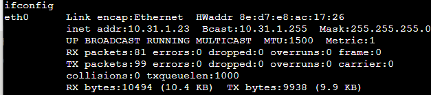 </p>

**Alabasta**

<p align="center"> 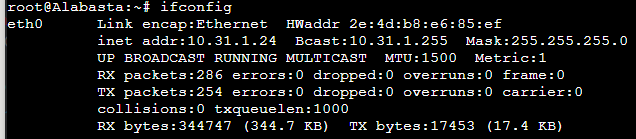 </p>

# 6

### Lama waktu DHCP server meminjamkan alamat IP kepada Client yang melalui Switch1 selama 6 menit sedangkan pada client yang melalui Switch3 selama 12 menit. Dengan waktu maksimal yang dialokasikan untuk peminjaman alamat IP selama 120 menit.

**Jipangu** `/etc/dhcp/dhcpd.conf`

```bash
subnet 10.31.1.0 netmask 255.255.255.0 {
    range  10.31.1.20 10.31.1.99;
    range  10.31.1.150 10.31.1.169;
    option routers 10.31.1.1;
    option broadcast-address 10.31.1.255;
    option domain-name-servers 10.31.2.2;
    default-lease-time 360;
    max-lease-time 7200;
}

subnet 10.31.3.0 netmask 255.255.255.0 {
    range  10.31.3.30 10.31.3.50;
    option routers 10.31.3.1;
    option broadcast-address 10.31.3.255;
    option domain-name-servers 10.31.2.2;
    default-lease-time 720;
    max-lease-time 3600;
}
```

# 7

### Luffy dan Zoro berencana menjadikan **Skypie** sebagai server untuk jual beli kapal yang dimilikinya dengan **alamat IP yang tetap** dengan IP [prefix IP].3.69

Cek di `ip a` untuk mendapatkan hardware ethernet

<p align="center"> 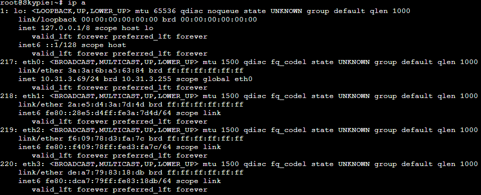 </p>

**Jipangu** `/etc/dhcp/dhcpd.conf`

```bash
host Skypie {
	hardware ethernet 3a:3a:6b:a5:63:84;
	fixed-address 10.31.3.69;
}
```

Edit network configuration pada Skypie

```bash
auto eth0
iface eth0 inet dhcp
hwadress ether 3a:3a:6b:a5:63:84
```

# 8

### Pada Loguetown, proxy **harus bisa diakses** dengan nama **jualbelikapal.yyy.com** dengan **port** yang digunakan adalah **5000**

**Water7** `/etc/squid/squid.conf`

```bash
http_port 5000
visible_hostname jualbelikapal.e04.com
```

Lalu lakukan `service squid restart`

Untuk melakukan pengetesan jalankan script berikut

```bash
export http_proxy=http://10.31.2.3:5000
env | grep -i proxy
lynx http://its.ac.id
```

<p align="center"> 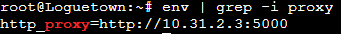 </p>

<p align="center"> 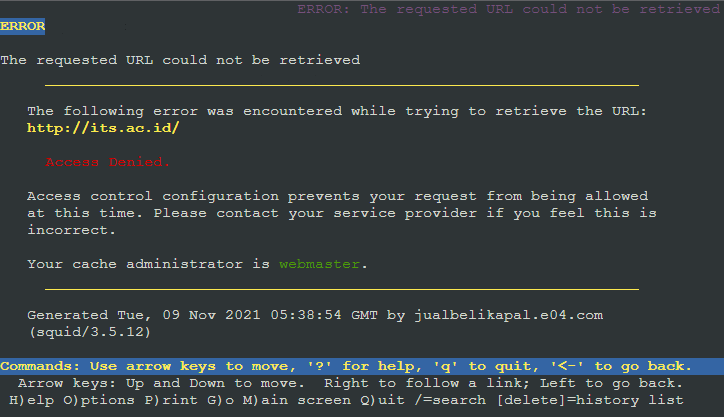 </p>

Agar bisa diakses tambah pada **Loguetown** `/etc/squid/squid.conf`

```bash
http_port 5000
visible_hostname jualbelikapal.e04.com

http_access allow all
```

Lakukan kembali `service squid restart`, setelahnya akan bisa mengakses `lynx http://its.ac.id`

Note: dalam pengerjaan ada kendala dalam mengakses `http:its.ac.id` sebagai berikut 

<p align="center"> 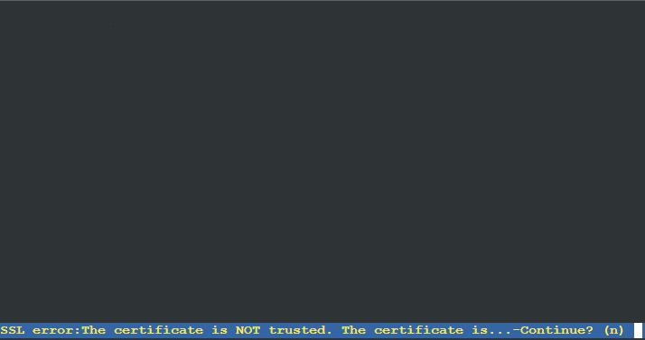 </p>

<p align="center"> 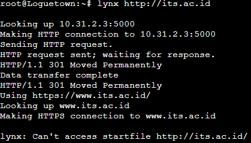 </p>

Untuk itu dialihkan ke `[http://monta.if.its.ac.id](http://monta.if.its.ac.id)` dengan hasil bisa diakses

<p align="center"> 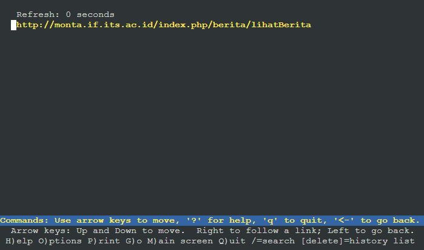 </p>

# 9

### Agar transaksi jual beli lebih aman dan pengguna website ada dua orang, proxy ****dipasang **autentikasi user proxy dengan enkripsi MD5** dengan **dua username,** yaitu luffybelikapalyyy dengan password ****luffy_yyy **dan** zorobelikapalyyy dengan password zoro_yyy

Buat file untuk simpan username dan password pada **Water7**

```bash
touch /etc/squid/passwd
htpasswd -m /etc/squid/passwd luffybelikapale04
htpasswd -m /etc/squid/passwd zorobelikapale04
```

Masukkan password sesuai ketentuan soal:

- luffybelikapale04: luffy_e04
- zorobelikapale04: zoro_e04

**Water7** `/etc/squid/squid.conf`

```bash
http_port 5000
visible_hostname jualbelikapal.e04.com

auth_param basic program /usr/lib/squid/basic_ncsa_auth /etc/squid/passwd
auth_param basic children 5
auth_param basic realm Proxy
auth_param basic credentialsttl 2 hours
auth_param basic casesensitive on
acl USERS proxy_auth REQUIRED
http_access allow USERS
```

Lalu lakukan `service squid restart` dan coba akses kembali `lynx http://its.ac.id` menggunakan username dan password yang telah dibuat.

# 10

### Transaksi jual beli tidak dilakukan setiap hari, oleh karena itu akses internet dibatasi hanya dapat diakses setiap hari **Senin-Kamis pukul 07.00-11.00** dan setiap hari **Selasa-Jum’at pukul 17.00-03.00** keesokan harinya **(sampai Sabtu pukul 03.00)**

**Water7** `/etc/squid/acl.conf`

```bash
acl AVAILABLE_WORKING time MTWHF 07:00-11:00
acl AVAILABLE_WORKING1 time TWHF 17:00-24:00
acl AVAILABLE_WORKING2 time WHFA 00:00-03:00
```

**Water7** `/etc/squid/squid.conf`

```bash
include /etc/squid/acl.conf

http_port 5000
visible_hostname jualbelikapal.e04.com

auth_param basic program /usr/lib/squid/basic_ncsa_auth /etc/squid/passwd
auth_param basic children 5
auth_param basic realm Proxy
auth_param basic credentialsttl 2 hours
auth_param basic casesensitive on
acl USERS proxy_auth REQUIRED

http_access allow AVAILABLE_WORKING USERS
http_access allow AVAILABLE_WORKING1 USERS
http_access allow AVAILABLE_WORKING2 USERS

http_access deny all
```

Untuk mencoba waktu akses bisa mengganti waktu menggunakan

- `date -s "8 NOV 2021 10:00:00"` dimana waktu tersebut bisa diakses
- `date -s "8 NOV 2021 13:00:00"` dimana waktu tersebut tidak bisa diakses

lalu akses kembali `lynx http://its.ac.id`

# 11

### Agar transaksi bisa lebih fokus berjalan, maka dilakukan redirect website agar mudah mengingat website transaksi jual beli kapal. Setiap **mengakses google.com, akan diredirect menuju super.franky.yyy.com** dengan website yang sama pada soal shift modul 2. Web server super.franky.yyy.com berada pada node **Skypie**

**EniesLobby**  `/etc/bind/named.conf.local`

```bash
zone "e04.com" {
        type master;
        file "/etc/bind/e04/e04.com";
};
```

**EniesLobby** `/etc/bind/kaizoku/super.franky.e04.com`

```bash
;
; BIND data file for local loopback interface
;
$TTL    604800
@       IN      SOA     e04.com. root.e04.com. (
                     2021110802         ; Serial
                         604800         ; Refresh
                          86400         ; Retry
                        2419200         ; Expire
                         604800 )       ; Negative Cache TTL
;
@               IN      NS      e04.com.
@               IN      A       10.31.2.2
jualbelikapal   IN      A       10.31.2.3
super.franky    IN      A       10.31.3.69
```

Tambahkan pada Skypie `/etc/apache2/apache2.conf`

```bash
ServerName 10.31.3.69
```

**Skypie** `/etc/apache2/sites-available/super.franky.e04.com.conf`

```bash
<VirtualHost *:80>
    ServerName super.franky.e04.com
    ServerAlias www.super.franky.e04.com

    ServerAdmin webmaster@localhost
    DocumentRoot /var/www/super.franky.e04.com

    <Directory /var/www/super.franky.e04.com>
        Options +Indexes
    </Directory>

    <Directory /var/www/super.franky.e04.com/public>
        Options +Indexes
    </Directory>

    Alias "/js" "/var/www/super.franky.e04.com/public/js"

    ErrorLog ${APACHE_LOG_DIR}/error.log
    CustomLog ${APACHE_LOG_DIR}/access.log combined

    ErrorDocument 404 /error/404.html
</VirtualHost>
```

Setelahnya unzip dari `wget [https://raw.githubusercontent.com/FeinardSlim/Praktikum-Modul-2-Jarkom/main/super.franky.zip](https://raw.githubusercontent.com/FeinardSlim/Praktikum-Modul-2-Jarkom/main/super.franky.zipd)` dan pindahkan ke `/var/www/super.franky.e04.com` di **Skypie**.

Untuk melakukan pegetesan lakukan `lynx http://super.franky.e04.com`

**Water7** `/etc/squid/squid.conf`

```bash
include /etc/squid/acl.conf

http_port 5000
visible_hostname jualbelikapal.e04.com

auth_param basic program /usr/lib/squid/basic_ncsa_auth /etc/squid/passwd
auth_param basic children 5
auth_param basic realm Proxy
auth_param basic credentialsttl 2 hours
auth_param basic casesensitive on
acl USERS proxy_auth REQUIRED

http_access allow AVAILABLE_WORKING USERS
http_access allow AVAILABLE_WORKING1 USERS
http_access allow AVAILABLE_WORKING2 USERS

acl BLACKLIST dstdomain google.com
deny_info http://super.franky.e04.com/ BLACKLIST
http_reply_access deny BLACKLIST

http_access deny all
```

Lakukan pengetesan kembali menggunakan `lynx google.com`

# 12

### Saatnya berlayar! Luffy dan Zoro akhirnya memutuskan untuk berlayar untuk **mencari harta karun di super.franky.yyy.com**. Tugas pencarian dibagi menjadi dua misi, Luffy bertugas untuk **mendapatkan gambar (.png, .jpg)**, sedangkan Zoro **mendapatkan sisanya**. Karena Luffy orangnya sangat teliti untuk mencari harta karun, ketika ia berhasil mendapatkan gambar, ia mendapatkan gambar dan melihatnya dengan kecepatan **10 kbps**

**Water7** `/etc/squid/acl-bandwidth.conf`

```bash
acl luffy proxy_auth luffybelikapale04
acl zoro proxy_auth zorobelikapale04

delay_pools 2
delay_class 1 1
delay_parameters 1 1250/1250
delay_access 1 deny zoro
delay_access 1 allow download
delay_access 1 deny all
```

Lakukan `service squid restart`

Lalu lakukan `lynx[super.franky.e04.com/public/images](http://super.franky.e04.com/public/images)` agar mempermudah pengecekan kecepatan dan masukkan username dan password Luffy

<p align="center"> 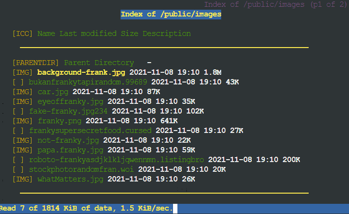 </p>

# 13

### **Sedangkan, Zoro yang sangat bersemangat untuk mencari harta karun, sehingga kecepatan kapal Zoro tidak dibatasi ketika sudah mendapatkan harta yang diinginkannya**

**Water7** `/etc/squid/acl-bandwidth.conf`

```bash
acl luffy proxy_auth luffybelikapale04
acl zoro proxy_auth zorobelikapale04

delay_pools 2
delay_class 1 1
delay_parameters 1 1250/1250
delay_access 1 deny zoro
delay_access 1 allow download
delay_access 1 deny all

delay_class 2 1
delay_parameters 2 -1/-1
delay_access 2 allow zoro
delay-access 2 deny luffy
delay_access 2 deny all
```