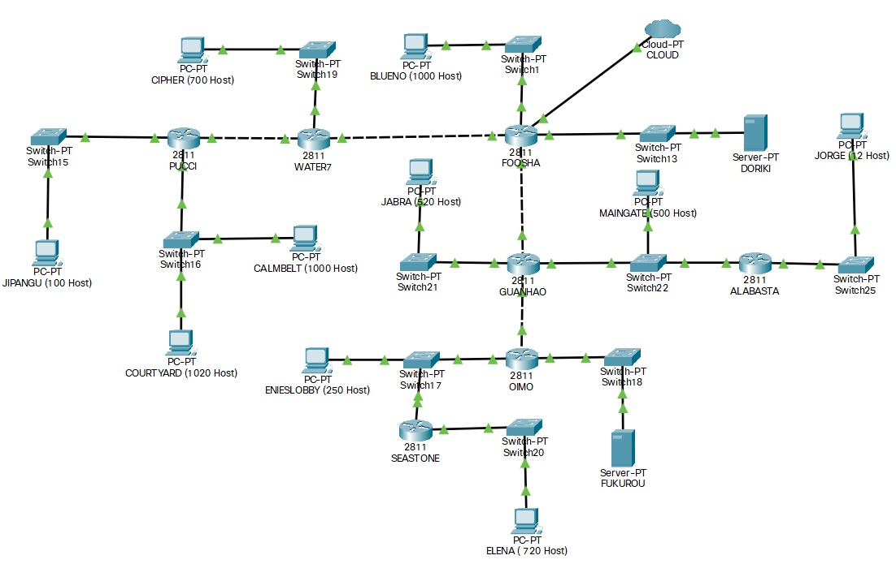
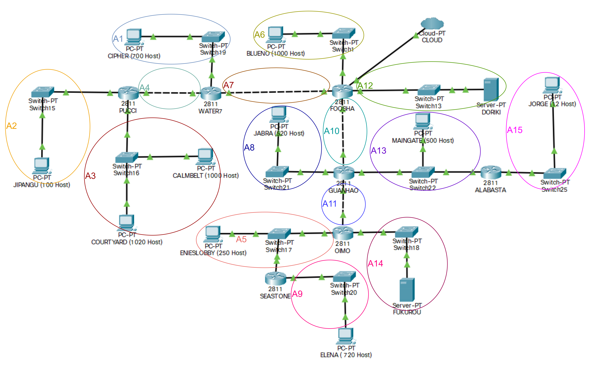
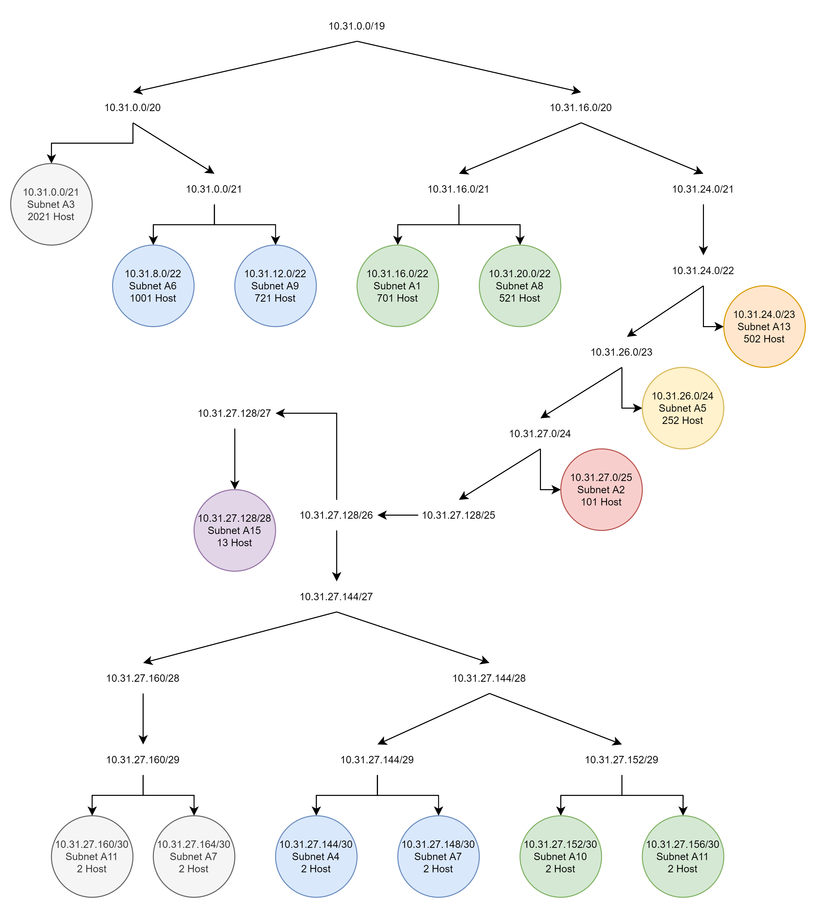
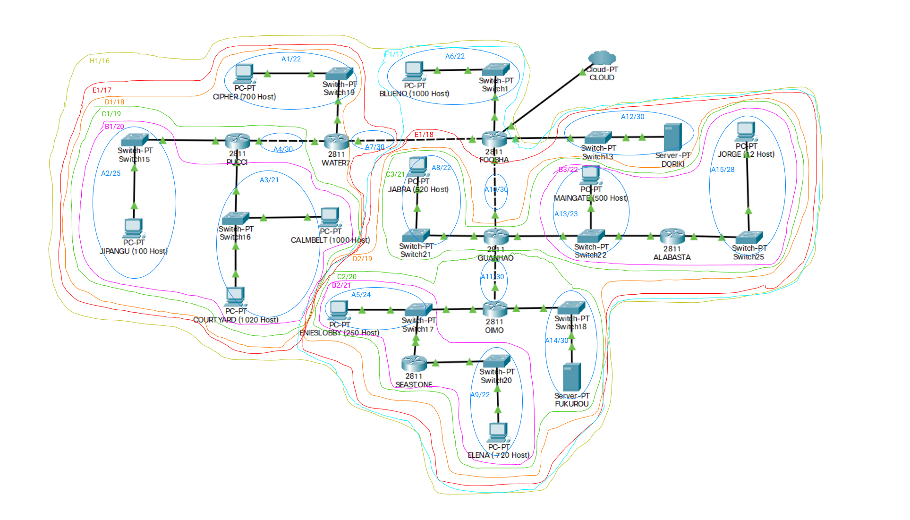
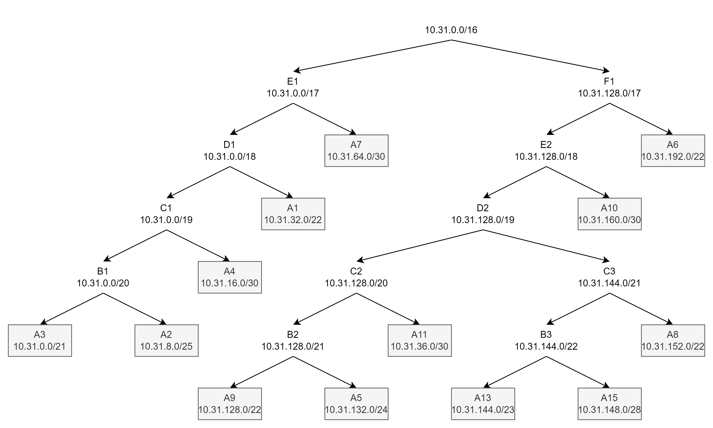

# Jarkom-Modul-4-E04-2021

## Kelompok E04

1. I Kadek Agus Ariesta Putra 05111940000105
2. Axel Briano Suherik 05111940000137
3. Timotius Wirawan 05111940000161

## Pembagian Pengerjaan Soal Praktikum
- CIDR(Subnetting dan Tree): Axel Briano Suherik
- CPT(Subnetting dan Tree): Timotius Wirawan
- CPT(Routing) & CIDR(Routing): I Kadek Agus Ariesta Putra

# Soal
Subnetting & Routing
<p align="center">  </p>

## Pembagian Metode
- CPT: VLSM
- GNS3: CIDR

# VLSM (CPT)

## Subnet

<p align="center">  </p>

| Subnet | Jumlah IP | Netmask |
| --- | --- | --- |
| A1 | 701 | /22 |
| A2 | 101 | /25 |
| A3 | 2021 | /21 |
| A4 | 2 | /30 |
| A5 | 252 | /24 |
| A6 | 1001 | /22 |
| A7 | 2 | /30 |
| A8 | 521 | /22 |
| A9 | 721 | /22 |
| A10 | 2 | /30 |
| A11 | 2 | /30 |
| A12 | 2 | /30 |
| A13 | 502 | /23 |
| A14 | 2 | /30 |
| A15 | 13 | /28 |
| Total | 5845 | /19 |

# Tree

<p align="center">  </p>

Berdasarkan tree di atas, pembagian NID dan BA setiap subnet adalah sebagai berikut

| Subnet | Network ID | Broadcast Address |
| --- | --- | --- |
| A1 | 10.31.16.0 | 10.31.19.255 |
| A2 | 10.31.27.0 | 10.31.27.127 |
| A3 | 10.31.0.0 | 10.31.7.255 |
| A4 | 10.31.27.144 | 10.31.27.147 |
| A5 | 10.31.26.0 | 10.31.26.255 |
| A6 | 10.31.8.0 | 10.31.11.255 |
| A7 | 10.31.27.148 | 10.31.27.151 |
| A8 | 10.31.20.0 | 10.31.23.255 |
| A9 | 10.31.12.0 | 10.31.15.255 |
| A10 | 10.31.27.152 | 10.31.27.155 |
| A11 | 10.31.27.156 | 10.31.27.159 |
| A12 | 10.31.27.160 | 10.31.27.163 |
| A13 | 10.31.24.0 | 10.31.25.255 |
| A14 | 10.31.27.164 | 10.31.27.167 |
| A15 | 10.31.27.128 | 10.31.27.143 |

## Routing

### FOOSHA

```bash
10.31.16.0/22 via 10.31.27.150
10.31.27.144/30 via 10.31.27.150
10.31.27.0/25 via 10.31.27.150
10.31.0.0/21 via 10.31.27.150
10.31.20.0/22 via 10.31.27.154
10.31.27.128/28 via 10.31.27.154

10.31.27.156/30 via 10.31.27.154
10.31.27.164/30 via 10.31.27.154

10.31.26.0/24 via 10.31.27.154
10.31.12.0/24 via 10.31.27.154
```

### WATER7

```bash
0.0.0.0/0 via 10.31.27.149
10.31.27.0/25 via 10.31.27.149
10.31.0.0/25 via 10.31.27.149
```

### PUCCI

```bash
0.0.0.0/0 via 10.31.27.145
```

### GUANHAO

```bash
0.0.0.0/0 via 10.31.27.153
10.31.27.128/28 via 10.31.24.3

10.31.26.0/24 via 10.31.27.158
10.31.27.164/30 via 10.31.27.158
10.31.12.0/22 via 10.31.27.158
```

### ALABASTA

```bash
0.0.0.0/0 via 10.31.24.1
```

### OIMO

```bash
10.31.12.0/22 via 10.31.26.3
0.0.0.0/0 via 10.31.27.157
```

### SEASTONE

```bash
0.0.0.0/0 via 10.31.26.1
```

# CIDR (GNS3 Project)

## Subnet

<p align="center">  </p>

| Subnet | Alias | NID | Netmask | Length | IP Yang Diperlukan | Broadcast |
| --- | --- | --- | --- | --- | --- | --- |
| A1 | Cipher-Water7 | 10.31.32.0 | 255.255.252.0 | /22 | 701 | 10.31.35.255 |
| A2 | Jipangu-Pucci | 10.31.8.0 | 255.255.252.128 | /25 | 101 | 10.31.8.127 |
| A3 | Pucci-Calmbelt-Courtyard | 10.31.0.0 | 255.255.248.0 | /21 | 2021 | 10.31.7.255 |
| A4 | Pucci-Water7 | 10.31.16.0 | 255.255.255.252 | /30 | 2 | 10.31.16.3 |
| A5 | Oimo-Enieslobby-Seastone | 10.31.4.0 | 255.255.255.0 | /24 | 252 | 10.31.4.255 |
| A6 | Blueno-Foosha | 10.31.128.0 | 255.255.252.0 | /22 | 1001 | 10.31.131.255 |
| A7 | Water7-Foosha | 10.31.64.0 | 255.255.255.252 | /30 | 2 | 10.31.64.3 |
| A8 | Jabra-Guanhao | 10.31.36.0 | 255.255.252.0 | /22 | 521 | 10.31.39.255 |
| A9 | Seastone-Elena | 10.31.0.0 | 255.255.252.0 | /22 | 721 | 10.31.3.255 |
| A10 | Foosha-Guanhao | 10.31.64.0 | 255.255.255.252 | /30 | 2 | 10.31.64.3 |
| A11 | Guanhao-Oimo | 10.31.16.0 | 255.255.255.252 | /30 | 2 | 10.31.16.3 |
| A12 | Foosha-Doriki | 10.31.128.0 | 255.255.255.252 | /30 | 2 | 10.31.128.3 |
| A13 | Guanhao-Maingate-Alabasta | 10.31.32.0 | 255.255.254.0 | /23 | 502 | 10.31.33.255 |
| A14 | Omimo-Fukurou | 10.31.8.0 | 255.255.255.252 | /30 | 2 | 10.31.8.3 |
| A15 | Alabasta-Jorge | 10.31.34.0 | 255.255.255.240 | /28 | 13 | 10.31.34.15 |

## Tree

<p align="center">  </p>

## Routing

### FOOSHA

```bash
iptables -t nat -A POSTROUTING -o eth0 -j MASQUERADE -s 10.31.0.0/16
iptables -t nat -A POSTROUTING -o eth0 -j MASQUERADE -s 151.63.10.0/30
iptables -t nat -A POSTROUTING -o eth0 -j MASQUERADE -s 151.100.10.0/30

route add -net 10.31.0.0 netmask 255.255.128.0 gw 10.31.64.1
route add -net 10.31.128.0 netmask 255.255.192.0 gw 10.31.160.2
route add -net 151.100.10.0 netmask 255.255.255.252 gw 10.31.160.2
```

### WATER7

```bash
route add -net 10.31.0.0 netmask 255.255.224.0 gw 10.31.16.1
route add -net 0.0.0.0 netmask 0.0.0.0 gw 10.31.64.2
```

### PUCCI

```bash
route add -net 0.0.0.0 netmask 0.0.0.0 gw 10.31.16.2
```

### GUANHAO

```bash
route add -net 10.31.148.0 netmask 255.255.255.240 gw 10.31.144.2
route add -net 10.31.128.0 netmask 255.255.240.0 gw 10.31.136.2
route add -net 151.100.10.0 netmask 255.255.255.252 gw 10.31.136.2
route add -net 0.0.0.0 netmask 0.0.0.0 gw 10.31.160.1
```

### ALABASTA

```bash
route add -net 0.0.0.0 netmask 0.0.0.0 gw 10.31.144.1
```

### OIMO

```bash
route add -net 10.31.128.0 netmask 255.255.252.0 gw 10.31.132.2
route add -net 0.0.0.0 netmask 0.0.0.0 gw 10.31.136.1
```

### SEASTONE

```bash
route add -net 0.0.0.0 netmask 0.0.0.0 gw 10.31.132.1
```