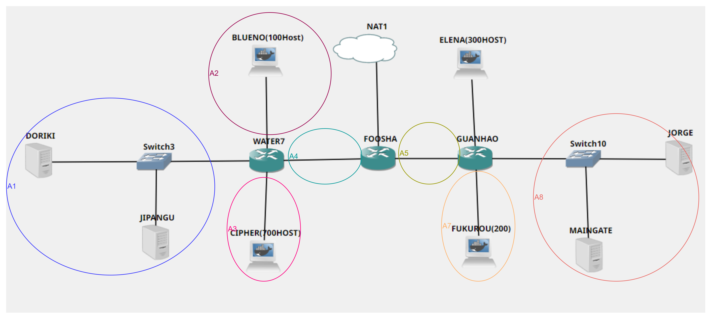
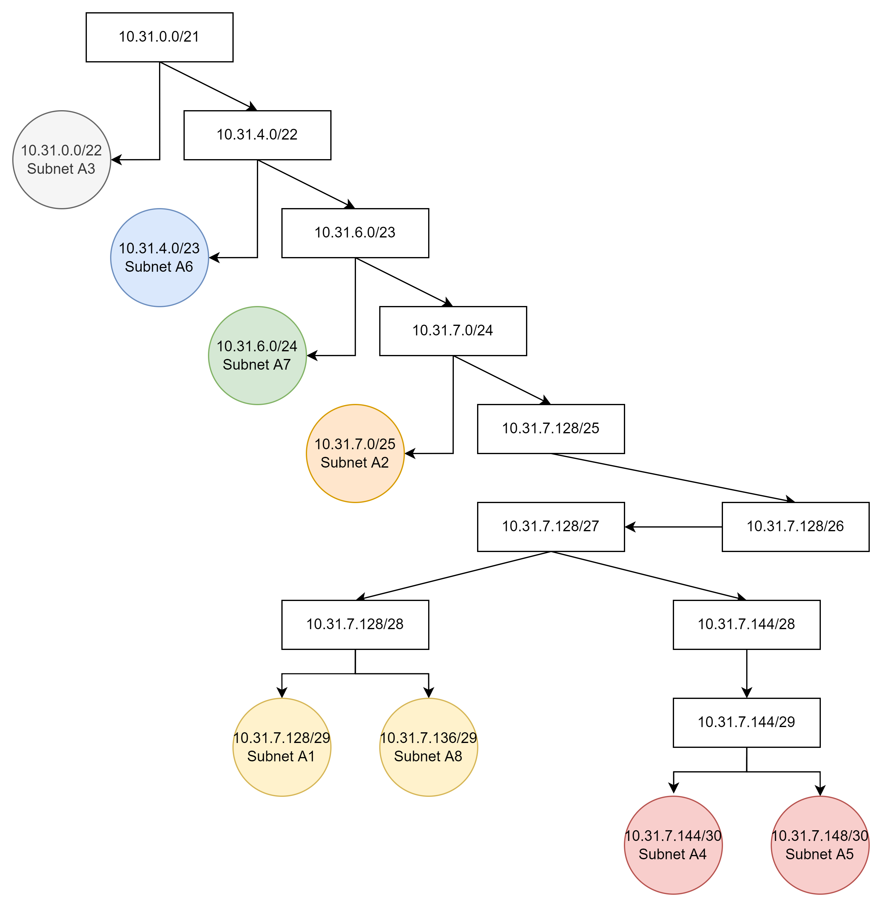
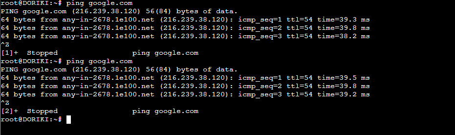
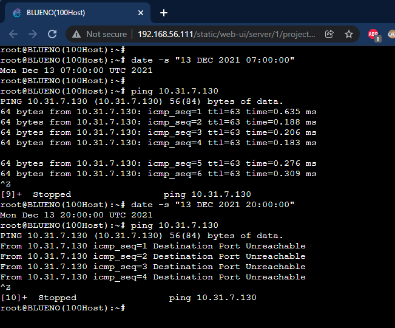
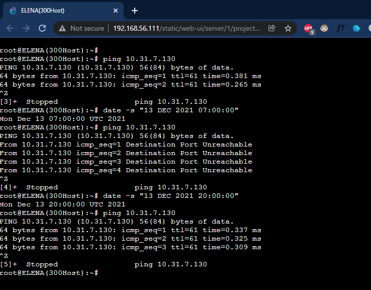
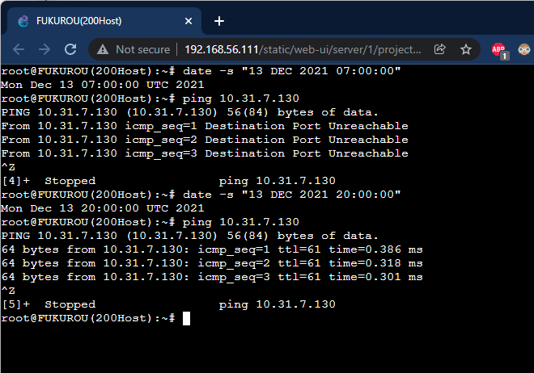
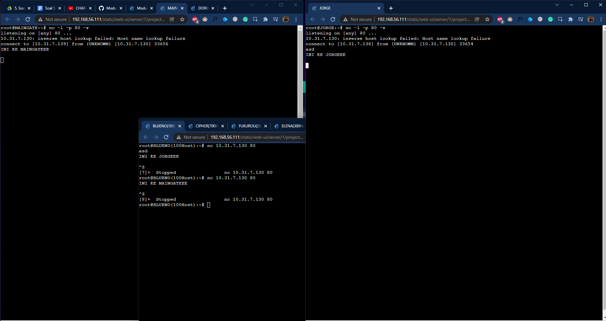

# Jarkom-Modul-5-E04-2021

# Pembagian Tugas

- Axel Briano Suherik: 1-2
- Timotius Wirawan: 3-4
- I Kadek Agus Ariesta Putra: 5-6

# Perhitungan Subnet

Menggunakan Classless VLSM (Variable Length Subnet Masking)

# Subnet

<p align="center">  </p>

# Table

| Subnet | Note | Jumlah IP | Length |
| --- | --- | --- | --- |
| A1 | Water7 - Doriki - Jipangu | 3 | 29 |
| A2 | Water7 - Blueno | 101 | 25 |
| A3 | Water7 - Cipher | 701 | 22 |
| A4 | Water7 - Foosha | 2 | 30 |
| A5 | Foosha - Guanhao | 2 | 30 |
| A6 | Guanhao - Elena | 301 | 23 |
| A7 | Guanhao - Fukurou | 201 | 24 |
| A8 | Guanhao - Maingate - Jorge | 3 | 29 |
| Total |  | 1314 | 21 |

# Tree

<p align="center">  </p>

# Pembagian IP

| Subnet | Note | Jumlah IP | Length | IP | Subnet Mask |
| --- | --- | --- | --- | --- | --- |
| A1 | Water7 - Doriki - Jipangu | 3 | 29 | 10.31.7.128 | 255.255.255.248 |
| A2 | Water7 - Blueno | 101 | 25 | 10.31.7.0 | 255.255.255.128 |
| A3 | Water7 - Cipher | 701 | 22 | 10.31.0.0 | 255.255.252.0 |
| A4 | Water7 - Foosha | 2 | 30 | 10.31.7.144 | 255.255.255.252 |
| A5 | Foosha - Guanhao | 2 | 30 | 10.31.7.148 | 255.255.255.252 |
| A6 | Guanhao - Elena | 301 | 23 | 10.31.4.0 | 255.255.254.0 |
| A7 | Guanhao - Fukurou | 201 | 24 | 10.31.6.0 | 255.255.255.0 |
| A8 | Guanhao - Maingate - Jorge | 3 | 29 | 10.31.7.136 | 255.255.255.248 |

# DNS Doriki

File :: /etc/bind/named.conf.options

```jsx
options {
        directory "/var/cache/bind";
        forwarders {
                192.168.122.1;
        };
        allow-query{any;};

        auth-nxdomain no;    # conform to RFC1035
		listen-on-v6 { any; };
};
```

# Jawaban Soal

## 1

Agar topologi yang kalian buat dapat mengakses keluar, kalian diminta untuk mengkonfigurasi Foosha menggunakan iptables, tetapi Luffy tidak ingin menggunakan MASQUERADE.

Jalankan script berikut pada FOOSHA

```bash
iptables -t nat -A POSTROUTING -s 10.31.0.0/21 -o eth0 -j SNAT --to-source 192.168.122.96
```

Lalu pada doriki test ping hasilnya adalah sebagai berikut:

<p align="center">  </p>

## 2

Kalian diminta untuk mendrop semua akses HTTP dari luar Topologi kalian pada server yang merupakan DHCP Server dan DNS Server demi menjaga keamanan.

Menggunakan FORWARD chain untuk menyaring paket dengan protokol TCP dari luar topologi menuju ke DHCP Server dan DNS Server yang berada di satu subnet yaitu 10.31.7.128/29 (A1), dimana akses HTTP (Port 80) yang masuk ke DHCP Server dan DNS Server akan di drop

Pada WATER7:

```bash
#iptables -A FORWARD -d 10.31.7.129 -p tcp --dport 80 -j DROP
iptables -A FORWARD -d 10.31.7.128/29 -i eth0 -p tcp --dport 80 -j DROP
```

Testnya di salah stau client ping ke salah satu perangkat di subnet di A1.

```bash
# nmap ke DORIKI
nmap 10.31.7.130 -p 80
```

## 3

Karena kelompok kalian maksimal terdiri dari 3 orang. Luffy meminta kalian untuk membatasi DHCP dan DNS Server hanya boleh menerima maksimal 3 koneksi ICMP secara bersamaan menggunakan iptables, selebihnya didrop. Di setiap IP yang memiliki DHCP dan DNS server lakukan:

```bash
iptables -A INPUT -p icmp -m connlimit --connlimit-above 3 --connlimit-mask 0 -j DROP
```

Menggunakan INPUT chain untuk menyaring paket dengan protokol ICMP yang masuk agar dibatasi hanya sebatas maksimal 3 koneksi saja menggunakan `--connlimit-above` 3 kemudian bisa diakses darimana saja menggunakan `--connlimit-mask` 0, jika lebih dari 3 akan di DROP

UJI COBA: Misalkan di uji coba pada BLUENO, lalu di test dengan melakukan ping ke blueno dari segala client. 

## Kemudian kalian diminta untuk membatasi akses ke Doriki yang berasal dari subnet Blueno, Cipher, Elena dan Fukuro dengan beraturan sebagai berikut

## 4

Akses dari subnet Blueno dan Cipher hanya diperbolehkan pada pukul 07.00 - 15.00 pada hari Senin sampai Kamis.

Pada DORIKI jalankan:

```bash
iptables -A INPUT -s 10.31.7.0/25 -m time --timestart 07:00 --timestop 15:00 --weekdays Mon,Tue,Wed,Thu -j ACCEPT
iptables -A INPUT -s 10.31.7.0/25 -j REJECT

iptables -A INPUT -s 10.31.0.0/22 -m time --timestart 07:00 --timestop 15:00 --weekdays Mon,Tue,Wed,Thu -j ACCEPT
iptables -A INPUT -s 10.31.0.0/22 -j REJECT
```

Uji Coba:

```bash
# Senin 7.00
date -s "13 DEC 2021 07:00:00" && ping 10.31.7.130
```

```bash
# Senin 20.00
date -s "13 DEC 2021 20:00:00" && ping 10.31.7.130
```

<p align="center">  </p>

## 5

Akses dari subnet Elena dan Fukuro hanya diperbolehkan pada pukul 15.01 hingga pukul 06.59 setiap harinya.

Pada DORIKI jalankan:

```bash
iptables -A INPUT -s 10.31.4.0/23 -m time --timestart 15:01 --timestop 06:59 -j ACCEPT
iptables -A INPUT -s 10.31.4.0/23 -j REJECT

iptables -A INPUT -s 10.31.6.0/24 -m time --timestart 15:01 --timestop 06:59 -j ACCEPT
iptables -A INPUT -s 10.31.6.0/24 -j REJECT
```

Uji Coba:

```bash
# Jam 7.00
date -s "13 DEC 2021 07:00:00" && ping 10.31.7.130
```

```bash
# Jam 20.00
date -s "13 DEC 2021 20:00:00" && ping 10.31.7.130
```

<p align="center">  </p>

<p align="center">  </p>

## 6

Karena kita memiliki 2 Web Server, Luffy ingin Guanhao disetting sehingga setiap request dari client yang mengakses DNS Server akan didistribusikan secara bergantian pada Jorge dan Maingate

```bash
iptables -t nat -A PREROUTING -p tcp -d 10.31.7.130 -m statistic --mode nth --every 2 --packet 0 -j DNAT --to-destination 10.31.7.138
iptables -t nat -A PREROUTING -p tcp -d 10.31.7.130 -j DNAT --to-destination 10.31.7.139

iptables -t nat -A POSTROUTING -p tcp -d 10.31.7.138 -j SNAT --to-source 10.31.7.130
iptables -t nat -A POSTROUTING -p tcp -d 10.31.7.139 -j SNAT --to-source 10.31.7.130
```

UJI COBA:

Pada JORGE listen ke port  80

`nc -l -p 80 -v` 

Pada MAINGATE listen ke port  80

`nc -l -p 80 -v` 

Lalu pada client BLUENO ketikkan 

`nc 10.31.7.130 80` 

Kirim pesan sembarang pada **BLUENO** ⇒ ia akan muncul di **JORGE** setelah selesai lalu stop, dan ketikkan kembali `nc 10.31.7.130 80`  , maka ia akan muncul di **MAINGATE**

<p align="center">  </p>